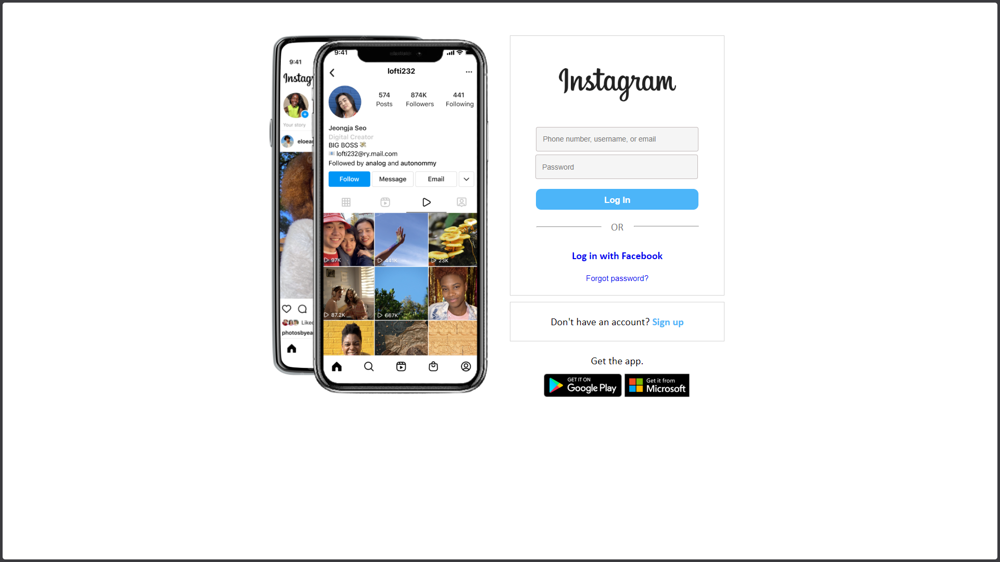
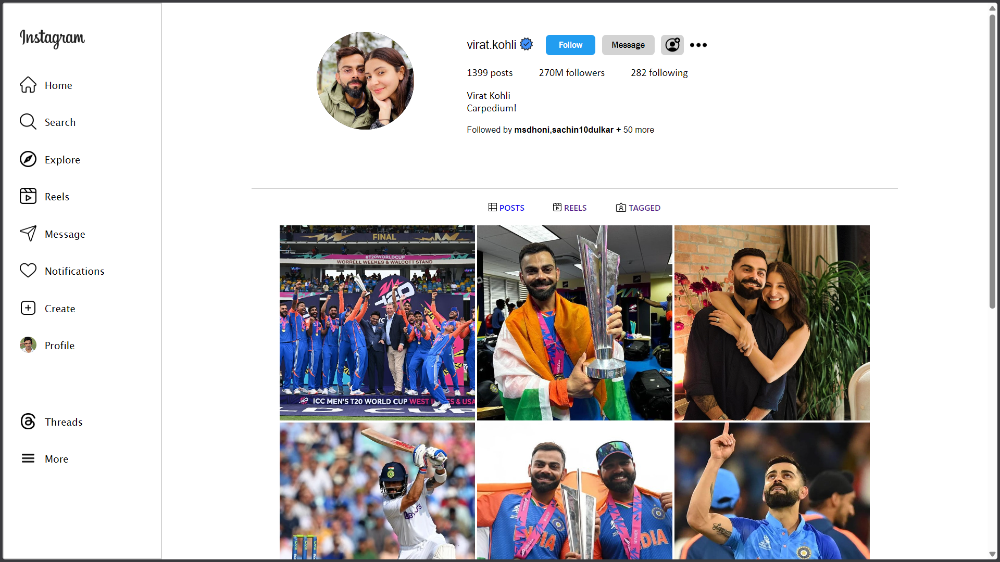
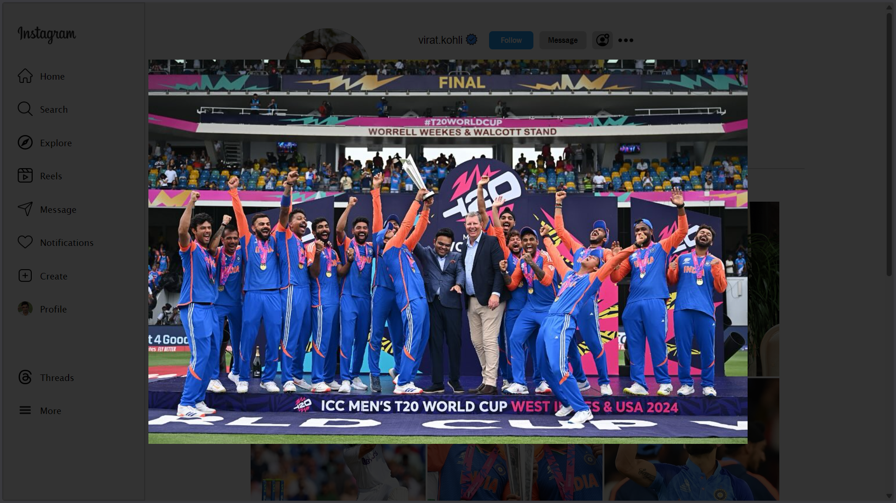

<div align="center">

# 🎥 **DupeGram — Instagram Frontend Clone with Authentication**


<br>
<br>
🔗 <strong>Live Demo: http://dupegram.onrender.com </strong>
<br>

### 🎨 *A frontend-focused Instagram-style clone featuring authentication and profile rendering.*

</div>

<p align="center">

<a href="https://github.com/akshitsharma-git/dupegram/stargazers">
  
</a>

<a href="https://github.com/akshitsharma-git/dupegram">
  
</a>

<a href="https://github.com/akshitsharma-git/dupegram/commits">
  
</a>

<br>


</p>

---

# 📌 **Overview**

DupeGram is a **frontend-focused Instagram clone** that replicates the **login flow and profile interface** of Instagram.

It includes **localStorage-based authentication** and a **default profile page** to demonstrate user state handling and UI rendering. 

The project focuses on **UI accuracy**, **auth logic**, and **frontend fundamentals**.

---

# ✨ **Features**

- 🔐 **Login authentication using localStorage**
- 👤 **Default profile page rendering**
- 🎨 **Instagram-style UI layout**
- 🧠 **Client-side state handling**
- ⚡ **Clean and responsive frontend**
- 🧪 **Frontend-focused implementation**

---

# 📸 **Demo Preview**




---

# 🛠 **Tech Stack**

| Layer | Technology |
|------|------------|
| **Frontend** | HTML, CSS, JavaScript |
| **Authentication** | localStorage |
| **UI Design** | Instagram-Inspired |
| **Version Control** | Git + GitHub |

---

# 🔍 **How It Works**

1. User logs in through the login page  
2. Authentication state is stored in `localStorage`  
3. On success, the profile page is rendered  
4. Session persists until logout or storage clear  

---

# 📁 **Project Structure**

```bash
dupegram/
│
├── assets/
│
├── index.html
├── login.html
├── signup.html
├── forget.html
├── profile.html
│
├── login.css
├── signup.css
├── forget.css
├── profile.css
│
├── login.js
├── signup.js
└── profile.js
```
---

# 💻 **Local Development Setup**

```bash
git clone https://github.com/akshitsharma-git/dupegram.git
cd dupegram
open index.html
```
---

# 🧠 **Philosophy**

> Learn by cloning. Improve by understanding.

DupeGram focuses on rebuilding familiar interfaces to strengthen frontend fundamentals and authentication logic.

---

# 📜 **License**

This project is licensed under the **MIT License**.

---

<div align="center">
  <strong>If you like this project, consider giving it a star ⭐</strong>
</div>

<br>

<p align="center">Made with ❤️ by Akshit Sharma</p>

